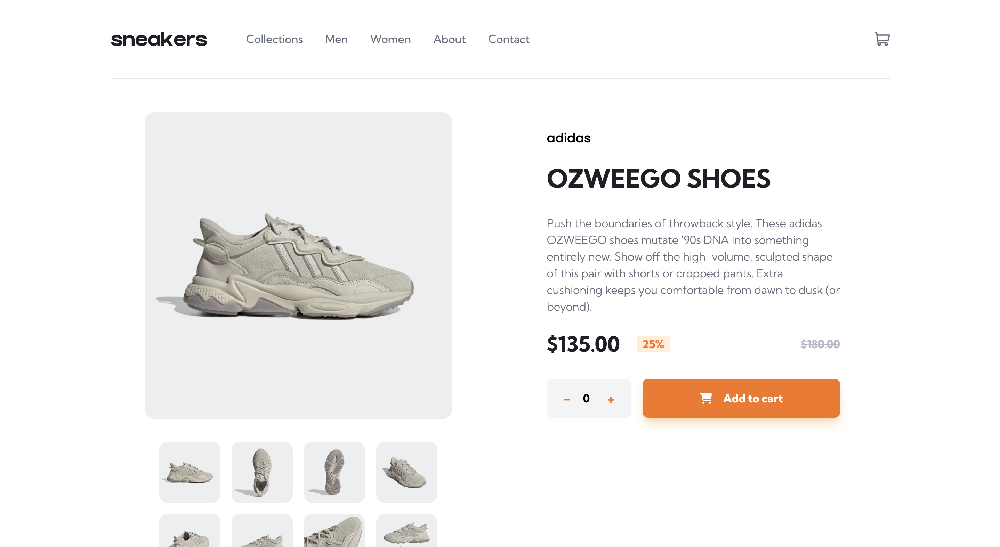

# sneakers-product-page
This product page has lightbox product gallery, and cart functionality.
This is the client-side code. The server-side code can be found here: [Sneakers Server](https://github.com/neshacascia/sneakers-server)

## Demo
[Live Demo](https://nc-sneakers-product-page.netlify.app)

## Built with
- React
- React Router v6
- Express
- Stripe API
- Vite
- TailwindCSS

## Features
- [x] View the optimal layout for each of the website's pages depending on their device's screen size
- [x] See hover states for all interactive elements on the page
- [x] Open a lightbox gallery by clicking on the large product image
- [x] Switch the large product image by clicking on the small thumbnail images
- [x] Add items to the cart
- [x] View the cart, increase and decrease quantities or remove items from it
- [x] Checkout items in the cart

## Running this Project Locally
From the repo:
1. Clone this project locally
2. Open the project in your preferred code editor
3. Open your terminal and `cd` to the project directory
4. Run `npm install` to install all relevant dependencies
5. Run `npm run dev` to start a dev server and view the project in your browser

## DevDependencies:
- React
- React Router DOM
- Vite
- autoprefixer
- PostCSS
- TailwindCSS
